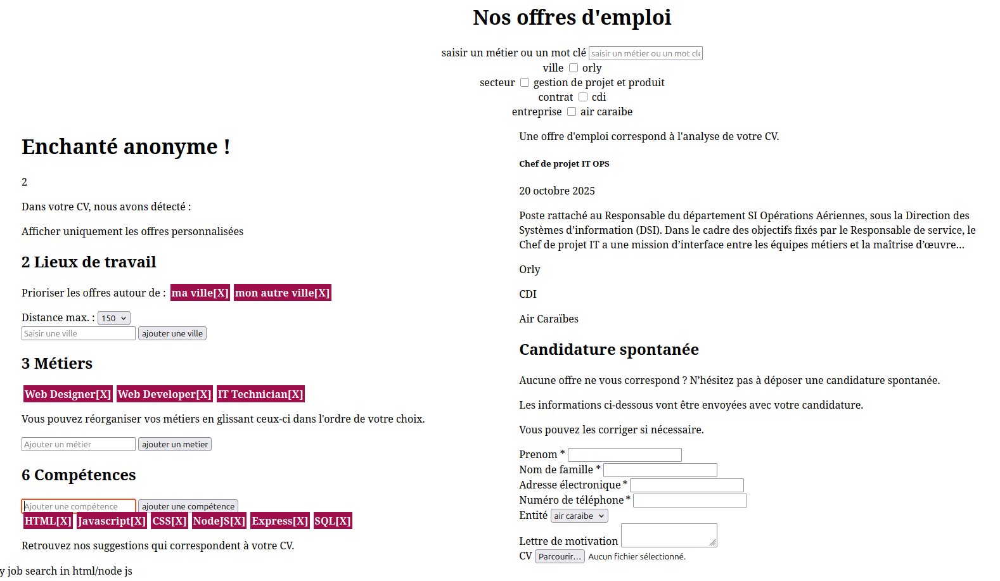
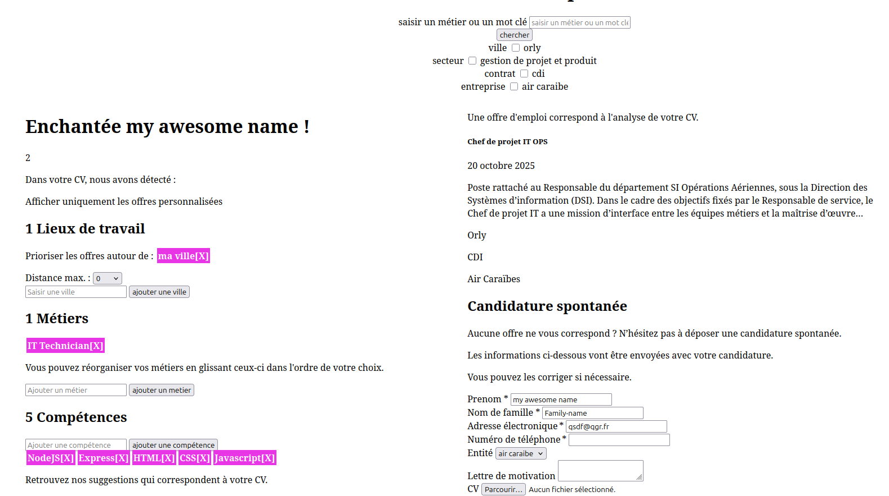

# reimagined-recherche-emploi
# README

- login sign up with passport


- chercher un travail
- cv skills, lieux de travail, nom de métiers

# friendly-job

````
mysql> create user 'myuser'@'localhost' IDENTIFIED WITH mysql_native_password BY 'passw   ';
Query OK, 0 rows affected (0,09 sec)

mysql> grant all privileges on *.* to myuser;
ERROR 1410 (42000): You are not allowed to create a user with GRANT
mysql> grant all privileges on *.* to myuser@localhost;
Query OK, 0 rows affected (0,19 sec)

mysql> flush privileges;
Query OK, 0 rows affected (0,06 sec)
````
